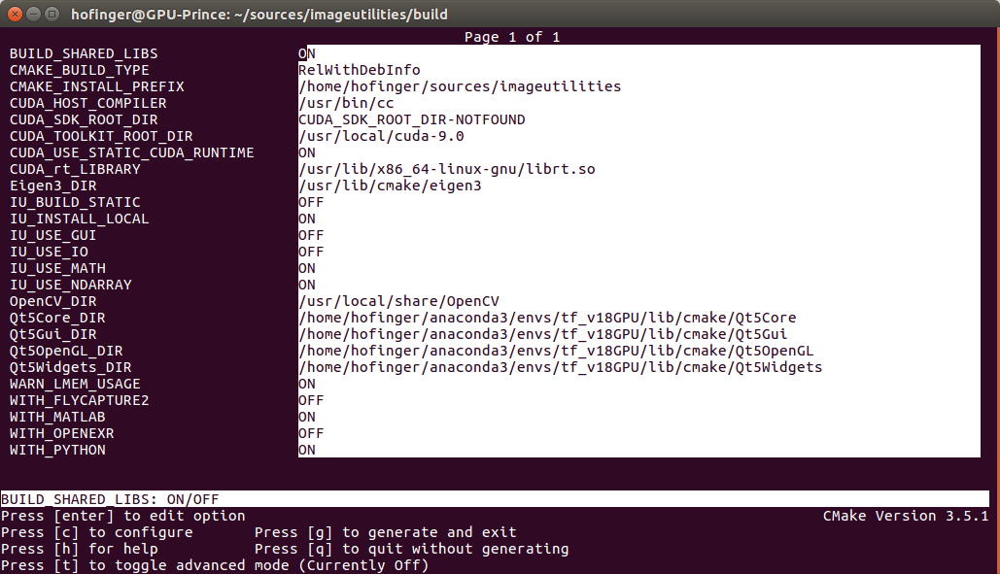
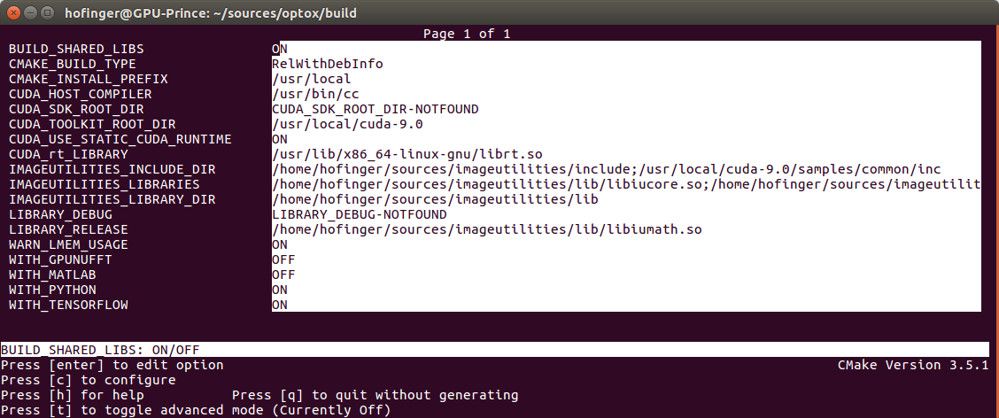

## Repository for operators and their interfaces to X.
##### The aim:
 Write an operator once and use it in Python, Matlab, Tensorflow, Pytorch, C++,...

##### The concept:
 Use the imageutilities as memory holding layer to build a more or less generic operator.
 To use it in your environment X (e.g. Tensorflow) you just need to write an interface wrapper.
 So you can test it thoroughly wiht your environment of choice and use the tested operator in all the other environments.
 Result Increansed reuseability :)
 
 E.g. for Python the current recommended way for using the operator is to build a pip package and install it in your desired anaconda environment.
 


### most important directories and files:
	- src        : the more generic base operator
	- matlab     : matlab wrappers, (or not yet ported matlab only operators)
	- tensorflow : tensorflow wrappers, (or not yet ported tensorflow only operators)
		- package: this subdirectory contains the files necessary for building the pip packages
			- 	build_pkg.sh  : this script builds the pip package 
			- 	setup.sh      : requirenments for the pip package

##Install instructions

### Prerequesits

Op To X requires [imageutilities](https://gitlab.icg.tugraz.at/imageutilities/imageutilities) in the dev_register_types branch.
setup a environment variable that points to the IMAGEUTILITIES_ROOT directory.
build and install imageutilities (setup the install path to e.g. the IMAGEUTILITIES_ROOT directory).
OpenCV is only required if the GUI or the IO functionality of the imageutilities is used.
Otherwise deactivate the IU_USE_IO and IO_USE_GUI switches with ccmake or cmake-gui while building the imageutilities.
Example Configuration of imageutilities:

```bash
#Setup where to install image utilities after compilation:
IMAGEUTILITIES_ROOT=~/sources/imageutilities 
MATLAB_ROOT=/usr/local/MATLAB/R2018b/
git clone git@gitlab.icg.tugraz.at:imageutilities/imageutilities.git
cd imageutilities
git checkout dev_register_types
#build imageutilities
mkdir build
cd build
# start ccmake and configure it as in the screenshot
ccmake .. 
# press 'c' to configure, check for erros, continure with 'e', then generate the make files by pressing 'g'
# build it with make:
make -j
# install it into the path specified in IMAGEUTILITIES_ROOT
make install 	
```


prepare the anaconda environment you want ot use for tensorflow etc.
activate it and install boost
```bash
conda install boost
```

### Building
in the OpToX directory:
configure cmake with ccmake or cmake-gui to use the correct path to the imageutilities libraries

```bash
cd build
rm -rf *
ccmake ..
```
Example Configuration:


now you can build optoX (-j use maximum number of threads)

```bash
make -j
```

## Now build the pip packages:
### Example for Tensorflow
-------------------------------

###### Build Wheel Package for Tensorflow:
Call the  `build_pkg.sh` script inside the `tensorflow/package` folder.
It copies the built libraries to a temp folder and tirggers the building of the pip-package.
Finally install the package


```bash
# copy the files (not needed any more)
# ln -s lib/tf/TfMetamorphosisOperator.so    tensorflow/package/optotf/interpolation/.
cd tensorflow/package
./build_pkg.sh
pip install -- upgrade dist/optotf-0.2.dev0-cp36-cp36m-linux_x86_64.whl
```

Test it in ipython/python with tensorflow
```python
from optotf.pad2d import pad2d
import numpy as np
import tensorflow as tf
sess = tf.InteractiveSession
inp = np.array([[[[1],[2],[3],[4.]]]])
padded = pad2d(inp,"SYMMETRIC",1)
padded.eval() #pad2d is NCHW format
>>>array([[[[1., 1., 1.],
            [1., 1., 1.],
            [2., 2., 2.],
            [3., 3., 3.],
            [4., 4., 4.],
            [4., 4., 4.]]]])
```

### Example for direct python operator
-------------------------------
Call the  `build_pkg.sh` script inside the `python/package` folder.
It copies the built libraries to a temp folder and tirggers the building of the pip-package.
Finally install the package

###### python - build wheel package:
This code depends on the 
```bash
cd python/package
./build_pkg.sh
pip install --upgrade dist/YOUR_BUILT_WHEEL_PACKAGE.whl
#pip install --upgrade dist/optotf-0.2.dev0-cp36-cp36m-linux_x86_64.whl 
cd ../..
```


Test it in ipython/python
```python
import numpy as np
import optopy.nabla   # only directly called submodules are imported
op = optopy.nabla.nabla_op()
op.forward( np.array([[0,1,1,2,0]],dtype=np.float32))
op.forward( np.array([[0,1,1,1,0],[0,0,1,0,0]],dtype=np.float32))
>>> array([[[ 1.,  0.,  0., -1.,  0.],
            [ 0.,  1., -1.,  0.,  0.]],

           [[ 0., -1.,  0., -1.,  0.],
            [ 0.,  0.,  0.,  0.,  0.]]], dtype=float32)

```