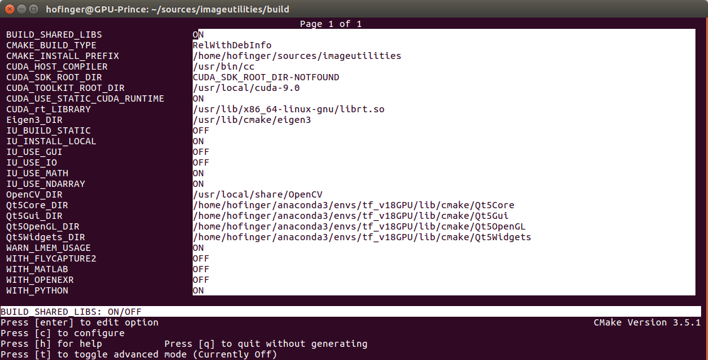

## Repository for operators and their interfaces to X.
The aim:
 Write an operator once and use it in Python, Matlab, Tensorflow, Pytorch, C++,...

The conceopt:
 Use the imageutilities as data holding layer for an relative generic operator.
 Test it with your environment of choice.
 To use it in your environment X (e.g. Tensorflow) you just need to write an interface wrapper.
 So you can re-use tested operators in many environments


##Install instructions

### Prerequesits

Op To X requires [imageutilities](https://gitlab.icg.tugraz.at/imageutilities/imageutilities) in the dev_register_types branch.
setup a environment variable that points to the IMAGEUTILITIES_ROOT directory.
build and install imageutilities (setup the install path to e.g. the IMAGEUTILITIES_ROOT directory).
OpenCV is only required if the GUI or the IO functionality of the imageutilities is used.
Otherwise deactivate the IU_USE_IO and IO_USE_GUI switches with ccmake or cmake-gui while building the imageutilities.
Example Configuration of imageutilities:



prepare the anaconda environment you want ot use for tensorflow etc.
activate it and install boost
```bash
conda install boost
```

### Building
in the OpToX directory:
configure cmake with ccmake or cmake-gui to use the correct path to the imageutilities libraries

```bash
cd build
rm -rf *
ccmake ..
```
Example Configuration:


now you can build optoX (-j use maximum number of threads)

```bash
make -j
```

##### Now build the pip packages:
**Attention** currently symbolic links are not automatically created, requires manuall step for each operator! 
For example for the nabla operator.
```bash
#ln -s ../../../../lib/python/PyNablaOperator.so .
ln -s lib/python/PyNablaOperator.so python/package/optopy/nabla/.
```
###### python - build wheel package:
This code depends on the 
```bash
cd python/package
./build_pkg.sh
pip install --upgrade dist/YOUR_BUILT_WHEEL_PACKAGE.whl
#pip install --upgrade dist/optotf-0.1.dev0-cp36-cp36m-linux_x86_64.whl 
cd ../..
```

###### tensorflow - build wheel package:
```bash
ln -s lib/tf/TfMetamorphosisOperator.so    tensorflow/package/optotf/interpolation/.
cd tensorflow/package
./build_pkg.sh
pip install -- upgrade dist/optotf-0.1.dev0-cp36-cp36m-linux_x86_64.whl
```

Test it in ipython/python
```python
import numpy as np
import optopy.nabla   # only directly called submodules are imported
op = optopy.nabla.nabla_op()
op.forward( np.array([[0,1,1,2,0]],dtype=np.float32))
op.forward( np.array([[0,1,1,1,0],[0,0,1,0,0]],dtype=np.float32))
```
